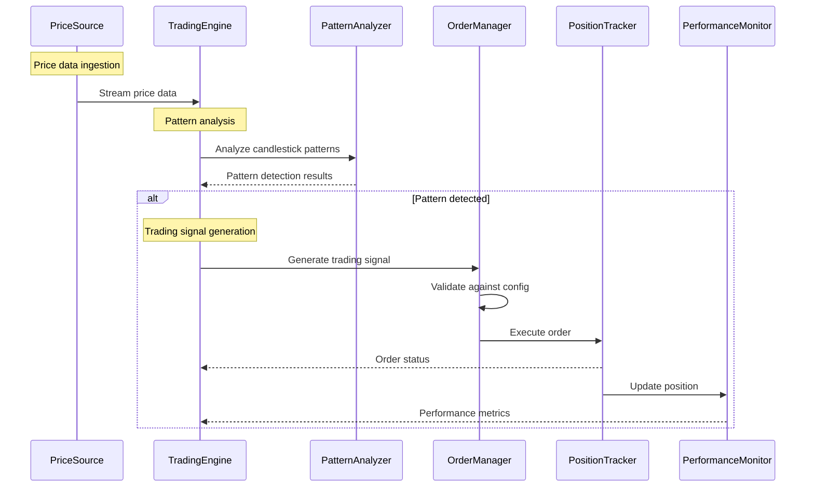
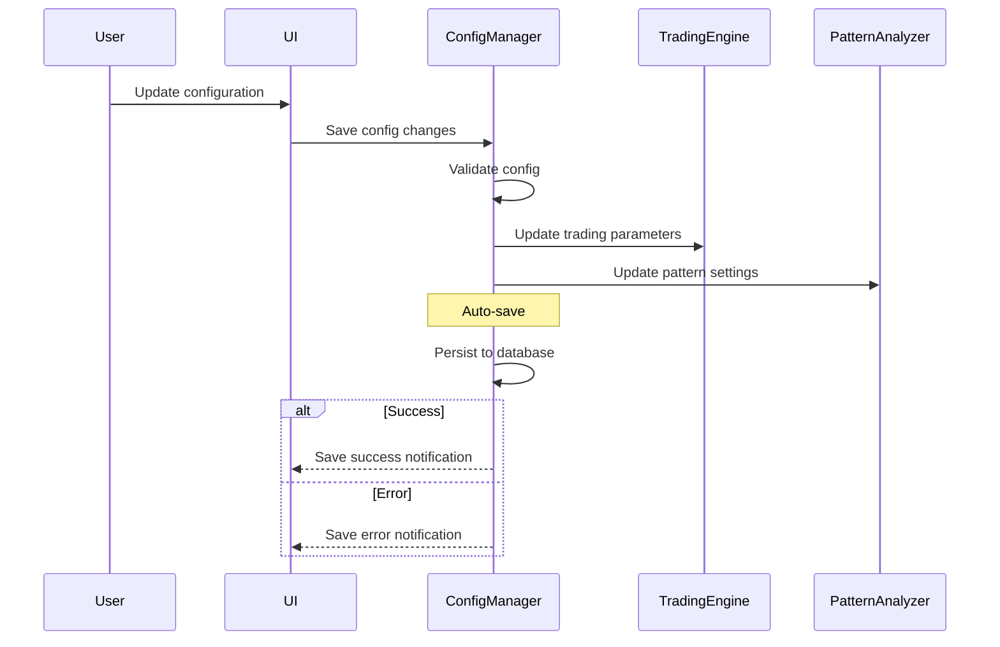
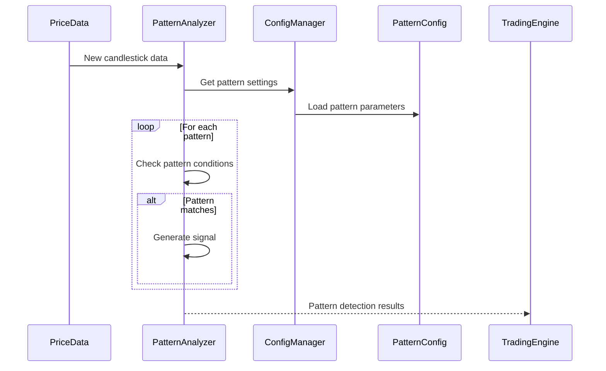

# Data Flow Diagrams

## Main Trading Flow

## Configuration Flow

## Pattern Detection Flow

## Notes on the Diagrams

1. **Main Trading Flow**
   - Shows the primary flow from price data to order execution
   - Includes position tracking and performance monitoring
   - Demonstrates the decision-making process for trade execution

2. **Configuration Flow**
   - Illustrates how configuration changes propagate through the system
   - Shows the auto-save mechanism
   - Includes error handling and user feedback

3. **Pattern Detection Flow**
   - Details the pattern analysis process
   - Shows how pattern configurations are loaded and applied
   - Demonstrates the signal generation process

These diagrams represent the high-level flow of data and operations in the trading bot. Each component can be further detailed with specific implementation details as needed. 